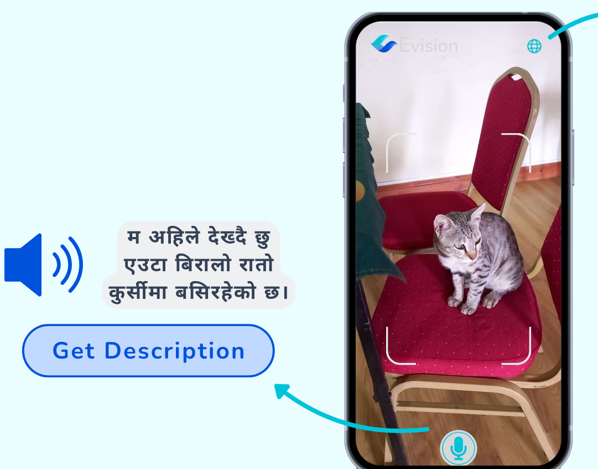

# Evision

 
 
Evision is an application designed to empower the low-vision community of Nepal. Build in Unity3d, it implements the LLaVa model for extracting descriptions and a Text-to-Speech (TTS) system based on Tacotron2 for language articulation. When users click the image from the application, Evision extracts the features of the scene and articulates them in Nepali, thereby enhancing accessibility.

## Introduction
Visual impairment hinders the independence of people, creating a barrier to engaging with the world around them. Evision aims to help individuals perceive their surroundings. Through the application, users can capture the surroundings from their smartphone's camera and receive a description of the scene in the Nepali language. This enables them to understand the environment through auditory feedback. Thus, Evision seeks to improve the quality of life for visually impaired individuals in Nepal.

## Features
- Scene description extraction using the LLaVa model
- Text-to-Speech (TTS) system based on Tacotron2 for language articulation
- Smartphone camera integration for capturing surroundings
- Auditory feedback in Nepali language

## Outputs  

Click the image to watch the video
# References

- S. Khadka, R. G.C., P. Paudel, R. Shah, B. Joshi. (2023). [Nepali Text-to-Speech Synthesis using Tacotron2 for Melspectrogram Generation](https://sigul-2023.ilc.cnr.it/wp-content/uploads/2023/08/15_Paper-compressed.pdf).

- [LLaVaVision](https://github.com/lxe/llavavision).

- Haotian Liu, Chunyuan Li, Qingyang Wu, Yong Jae Lee. (2023). [Visual Instruction Tuning](https://arxiv.org/abs/2304.08485).
